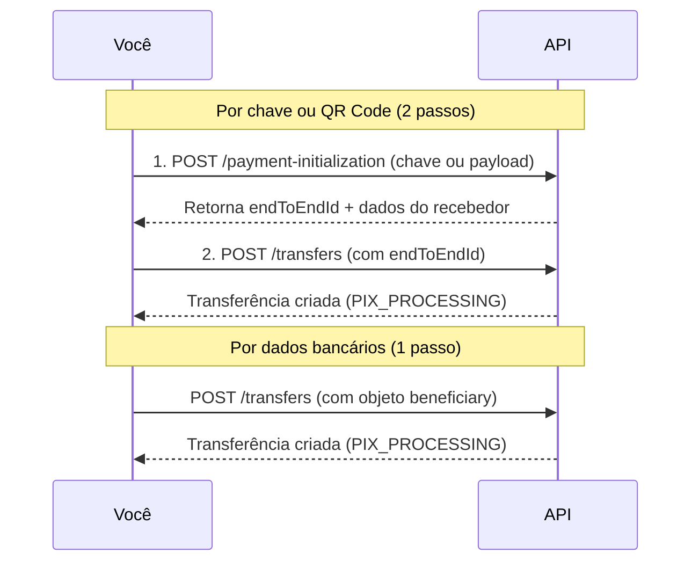

Enviar dinheiro via Pix pode ser iniciado de formas diferentes dependendo da informação que você tem disponível: uma chave Pix, os dados bancários da conta destino, ou um QR Code com o payload de cobrança.

Independentemente da forma de iniciação, **todos os pagamentos são executados pelo mesmo endpoint** — `POST /transfers`. O que muda é a etapa de **inicialização** anterior (quando necessária) e o valor do campo `initiationType` enviado no corpo da transferência.

## Formas de iniciação disponíveis

<CardGroup cols={3}>
  <Card title="Por chave Pix" icon="key" href="/guias/pix/pagar-pix/por-chave">
    Você tem a chave Pix do recebedor (CPF, CNPJ, e-mail, telefone ou EVP). A API consulta o DICT e retorna os dados da conta antes de executar o pagamento.
  </Card>
  <Card title="Por dados bancários" icon="building-columns" href="/guias/pix/pagar-pix/por-dados-bancarios">
    Você tem os dados completos da conta destino (banco, agência, conta, CPF/CNPJ). Não há etapa de inicialização — o pagamento é executado diretamente.
  </Card>
  <Card title="Por QR Code" icon="qrcode" href="/guias/pix/pagar-pix/por-qrcode">
    Você tem o payload de um QR Code (estático ou dinâmico). A API decodifica o payload, retorna os dados da cobrança e você executa o pagamento.
  </Card>
</CardGroup>

### Qual forma usar?

| | Por chave Pix | Por dados bancários | Por QR Code |
|---|---|---|---|
| Informação necessária | Chave Pix | Banco, agência, conta, CPF/CNPJ | Payload do QR Code |
| Etapa de inicialização | Sim (`/pix/dict/payment-initialization`) | Não | Sim (`/pix/qrcode/payment-initialization`) |
| Número de chamadas à API | 2 | 1 | 2 |
| `initiationType` no transfer | `KEY` | *(não enviado)* | `QR_CODE_STATIC` ou `QR_CODE_DYNAMIC` |
| Caso de uso típico | Transferências P2P, pagamentos com chave conhecida | Pagamentos para contas sem chave cadastrada | Pagamento de cobranças emitidas por terceiros |

## Como funciona o fluxo

<Warning>
A resposta do `POST /transfers` indica que o pagamento foi **enfileirado**, não que já foi liquidado. O status final (`PIX_EFFECTIVE` ou `PIX_ERROR`) chega via webhook. Não use polling como mecanismo principal de confirmação.
</Warning>

## Status do pagamento

| Status | Significado |
|---|---|
| `PIX_PROCESSING` | Pagamento recebido e sendo processado |
| `PIX_WAITING_SPI_RESPONSE` | Aguardando confirmação do Sistema de Pagamentos Instantâneos (BACEN) |
| `PIX_EFFECTIVE` | Pagamento liquidado com sucesso |
| `PIX_ERROR` | Pagamento falhou — verifique os detalhes para investigar |
| `PIX_REFUND_PAYMENT_UPDATED` | Evento de devolução enviada |

## Consultar um pagamento

Você pode consultar o status de qualquer pagamento a qualquer momento usando o `endToEndId` ou a `IdempotencyKey` da requisição original. Veja [Consultar Pagamento](/guias/pix/pagar-pix/consultar-pagamento).

## Próximos passos

<CardGroup cols={2}>
  <Card title="Pagar via chave Pix" icon="key" href="/guias/pix/pagar-pix/por-chave">
    Consulte a chave no DICT e execute a transferência.
  </Card>
  <Card title="Pagar via dados bancários" icon="building-columns" href="/guias/pix/pagar-pix/por-dados-bancarios">
    Envie diretamente para uma conta sem precisar de chave.
  </Card>
  <Card title="Pagar via QR Code" icon="qrcode" href="/guias/pix/pagar-pix/por-qrcode">
    Decodifique um payload e execute o pagamento da cobrança.
  </Card>
  <Card title="Consultar pagamento" icon="magnifying-glass" href="/guias/pix/pagar-pix/consultar-pagamento">
    Consulte o status de transferências Pix, TED e devoluções.
  </Card>
</CardGroup>
