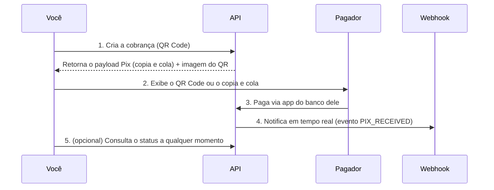

Receber via Pix, na prática, significa gerar um **QR Code de cobrança** que o seu pagador escaneia (ou copia e cola) no aplicativo do banco dele. Assim que o pagamento é liquidado no Banco Central, você recebe uma notificação em tempo real via **webhook**, e o valor cai na sua conta.

Toda cobrança Pix na API segue o mesmo ciclo de vida, o que muda entre os modelos é **quem define o valor**, **quantas vezes o QR Code pode ser pago** e **por quanto tempo ele fica válido**. Escolher o modelo certo aqui evita retrabalho de integração mais adiante.

## Modelos de cobrança disponíveis

<CardGroup cols={3}>
  <Card title="Cobrança Reutilizável" icon="repeat" href="/guias/pix/receber-pix/cobranca-reutilizavel">
    **QR Code Estático.** Um único código, reutilizável indefinidamente. Ideal para valores livres ou fixos em pontos de venda, doações e caixinhas.
  </Card>
  <Card title="Cobrança Imediata" icon="bolt" href="/guias/pix/receber-pix/cobranca-imediata">
    **QR Code Dinâmico.** Um código novo por cobrança, com expiração curta. Ideal para checkout de e-commerce e cobranças pontuais.
  </Card>
  <Card title="Cobrança com Vencimento" icon="calendar-clock" href="/guias/pix/receber-pix/cobranca-com-vencimento">
    **QR Code com Vencimento (cobv).** Cobrança com data de vencimento, juros, multa e desconto. Ideal para boletos, mensalidades e faturas.
  </Card>
</CardGroup>

### Qual modelo escolher?

| | Cobrança Reutilizável  *(QR Estático)* | Cobrança Imediata  *(QR Dinâmico)* | Cobrança com Vencimento  *(cobv)* |
|---|---|---|---|
| Quantidade de pagamentos por QR Code | Ilimitada | Única | Única |
| Valor | Fixo, livre ou ausente | Definido na criação | Definido na criação |
| Expira? | Não (até ser cancelado) | Sim, minutos após a criação | Sim, dias/meses após a criação |
| Juros, multa e desconto | Não | Não | Sim |
| Identifica automaticamente o pagador de qual pedido? | Não | Sim | Sim |
| Casos de uso comuns | Ponto de venda físico, doações, caixinha | Checkout de e-commerce, cobrança avulsa | Faturas, mensalidades, substituição de boleto |

<Tip>
Se você está migrando de boleto para Pix, o modelo mais próximo é a **Cobrança com Vencimento**, já que ela preserva conceitos como data de vencimento, multa e desconto por antecipação.
</Tip>

## Como funciona, de ponta a ponta

Independentemente do modelo escolhido, toda cobrança Pix segue o mesmo fluxo:

1. **Você cria a cobrança** informando os dados necessários (valor, expiração, identificador, dados do pagador quando aplicável).
2. **A API responde** com o `pix_copy_paste` (o payload Pix em texto, no padrão BR Code) e os dados para você mesmo renderizar o QR Code, ou uma imagem já pronta, dependendo do endpoint.
3. **Você apresenta o código** ao pagador — na tela de checkout, num totem, num app, por e-mail etc.
4. **O pagador paga** no aplicativo do banco dele. A liquidação acontece em segundos.
5. **Você é notificado via webhook** assim que o pagamento é confirmado — é esse evento que deve disparar a baixa do pedido no seu sistema, não uma consulta em polling.
6. **Opcionalmente**, você pode consultar o status da cobrança a qualquer momento pelos endpoints de consulta.

<Warning>
Não use consulta por polling como mecanismo principal de confirmação de pagamento. Os webhooks existem justamente para eliminar essa necessidade e evitar rate limiting desnecessário. Use a consulta apenas para reconciliação ou recuperação de falhas.
</Warning>

## Próximos passos

<CardGroup cols={2}>
  <Card title="Cobrança Reutilizável (QR Estático)" icon="repeat" href="/guias/pix/receber-pix/cobranca-reutilizavel">
    Crie, consulte e cancele um QR Code reutilizável.
  </Card>
  <Card title="Cobrança Imediata (QR Dinâmico)" icon="bolt" href="/guias/pix/receber-pix/cobranca-imediata">
    Crie uma cobrança de uso único com expiração, split e beneficiário final.
  </Card>
  <Card title="Cobrança com Vencimento" icon="calendar-clock" href="/guias/pix/receber-pix/cobranca-com-vencimento">
    Crie cobranças com data de vencimento, juros, multa e desconto.
  </Card>
  <Card title="Processando a confirmação via Webhook" icon="webhook" href="/guias/webhooks/visao-geral">
    Configure e trate o evento `PIX_RECEIVED` corretamente.
  </Card>
</CardGroup>