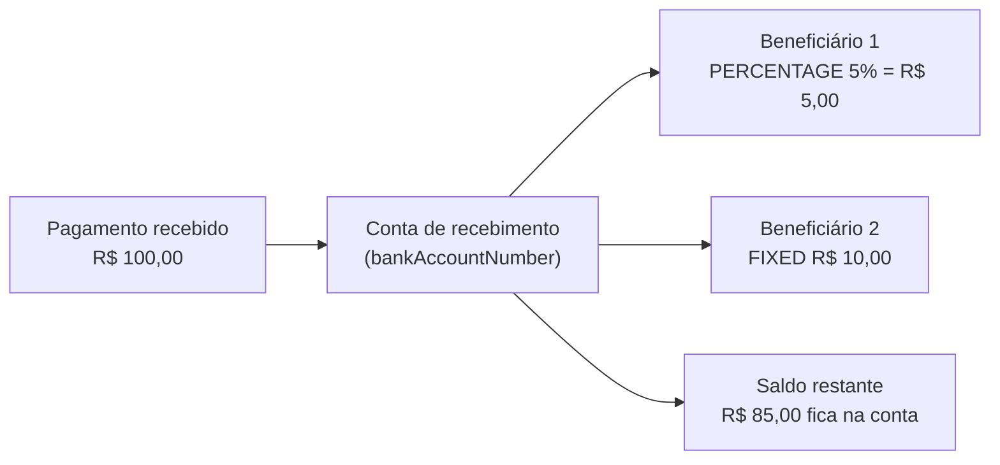

O Split de Pagamentos permite configurar regras de divisão automática para os valores recebidos em uma conta Delfinance. Assim que um pagamento é creditado na conta de origem, a Delfinance calcula e transfere as partes correspondentes para as contas dos beneficiários configurados, de acordo com as regras definidas. Sua aplicação não precisa fazer nada a cada recebimento.

<Tip>
Útil para marketplaces, plataformas de serviços e qualquer negócio que precise repassar parte de um recebimento para fornecedores, parceiros, afiliados ou franqueados sem processar isso manualmente.
</Tip>

## Como funciona

1. Você cria uma **configuração de Split** (`splitPaymentConfiguration`) associada a uma conta de recebimento (`bankAccountNumber`).
2. Para cada configuração, você cadastra um ou mais **beneficiários**, cada um com sua própria regra de divisão (`ruleType` + `ruleAmount`) e conta de destino.
3. A partir daí, todo pagamento recebido na conta de origem é automaticamente dividido entre os beneficiários configurados, de acordo com as regras vigentes no momento do recebimento.

<Note>
O Split é aplicado a **todos** os pagamentos recebidos na conta configurada. Não é possível aplicar o split apenas a transações específicas: a configuração vale para a conta como um todo.
</Note>

## O que é um beneficiário?

<Info>
**Beneficiário** é a conta que recebe uma parte do pagamento, logo depois que ele cai na conta principal (a de recebimento). Em uma configuração de Split você pode cadastrar um ou vários beneficiários, e cada um tem sua própria regra de quanto recebe.

O restante do valor, o que não foi destinado a nenhum beneficiário, permanece normalmente na conta de recebimento.
</Info>

Um jeito simples de visualizar: um pagamento de R$ 100 chega na sua conta, e a Delfinance repassa automaticamente a parte de cada beneficiário para a conta de destino configurada.

Um caso comum é o de um marketplace: o cliente paga o pedido inteiro na conta da plataforma, e uma fatia menor é repassada automaticamente para o vendedor ou para quem indicou a venda, sem que a plataforma precise fazer essa transferência manualmente.

## Tipos de regra

Cada beneficiário possui uma regra própria, definida pelo campo `ruleType`:

<CardGroup cols={2}>
  <Card title="PERCENTAGE" icon="percent">
    O valor repassado é calculado como uma porcentagem do valor total do pagamento. A porcentagem máxima permitida **por beneficiário** é de **5%**.
  </Card>
  <Card title="FIXED" icon="hashtag">
    O valor repassado é um valor absoluto e fixo, independente do valor do pagamento recebido. Se o valor definido exceder **50%** do valor da transação, o split não é executado para aquele pagamento.
  </Card>
</CardGroup>

<Warning>
Esses limites são validados a cada transação recebida, não apenas na criação da configuração. Um `ruleAmount` fixo que hoje representa menos de 50% do valor médio recebido pode ultrapassar esse limite em um pagamento de valor menor. Nesse caso, o split daquele beneficiário simplesmente não é aplicado naquela transação.
</Warning>

## Estrutura de dados

### Configuração de Split (`splitPaymentConfiguration`)

| Campo | Tipo | Descrição |
|---|---|---|
| `id` | `number` | Identificador único da configuração |
| `bankAccountNumber` | `string` | Conta onde os pagamentos são recebidos e divididos |
| `beneficiaries` | `array` | Lista de beneficiários e suas regras de divisão |
| `createdAt` | `string` | Data/hora de criação em ISO 8601 |
| `updatedAt` | `string` | Data/hora da última atualização em ISO 8601 |

### Beneficiário

| Campo | Tipo | Descrição |
|---|---|---|
| `id` | `number` | Identificador único do beneficiário dentro da configuração |
| `splitPaymentConfigurationId` | `number` | Configuração à qual o beneficiário pertence |
| `ruleType` | `enum` | `PERCENTAGE` ou `FIXED` |
| `ruleAmount` | `number` | Valor a aplicar, conforme o `ruleType` |
| `bankAccountNumber` | `string` | Conta de destino do repasse |
| `bankAccountBranch` | `string` | Agência da conta de destino |
| `bankIspb` | `string` | ISPB da instituição de destino |
| `pixKey` | `string` | Chave Pix associada à conta de destino, quando aplicável |
| `bankAccountType` | `string` | Tipo da conta de destino (ex: `PAYMENT`) |
| `holderDocument` | `string` | CPF/CNPJ do titular da conta de destino |
| `holderName` | `string` | Nome do titular da conta de destino |

## Próximos passos

<CardGroup cols={3}>
  <Card title="Configurar" icon="gear" href="/guias/split-pagamentos/configurar">
    Crie uma configuração de split e cadastre ou atualize beneficiários.
  </Card>
  <Card title="Consultar" icon="magnifying-glass" href="/guias/split-pagamentos/consultar">
    Liste todas as configurações ou consulte uma configuração específica por ID.
  </Card>
  <Card title="Remover" icon="trash" href="/guias/split-pagamentos/remover">
    Remova uma configuração inteira ou apenas um beneficiário específico.
  </Card>
</CardGroup>
