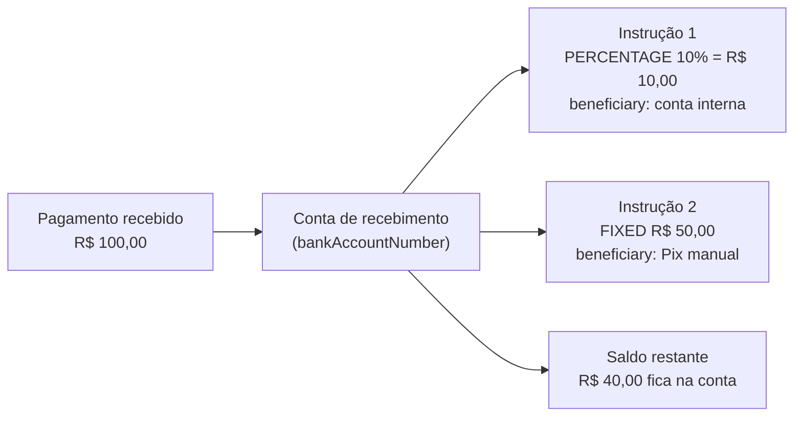

O Split de Pagamentos permite configurar regras de divisão automática para os valores recebidos em uma conta Delfinance. Assim que um pagamento é creditado na conta de origem, a Delfinance calcula e transfere as partes correspondentes para as contas de destino configuradas, de acordo com as regras definidas. Sua aplicação não precisa fazer nada a cada recebimento.

<Tip>
Útil para marketplaces, plataformas de serviços e qualquer negócio que precise repassar parte de um recebimento para fornecedores, parceiros, afiliados ou franqueados sem processar isso manualmente.
</Tip>

## Como funciona

1. Você cria uma **configuração de Split** associada a uma conta de recebimento (`bankAccountNumber`).
2. Para cada configuração, você cadastra uma ou mais **instruções** (`instructions`), cada uma definindo quanto repassar (`amount` + `type`), como o repasse é feito (`transferType`) e para quem (`beneficiary`).
3. A partir daí, todo pagamento recebido na conta de origem é dividido automaticamente conforme as instruções vigentes no momento do recebimento.

<Note>
O Split é aplicado a **todos** os pagamentos recebidos na conta configurada. Não é possível aplicar o split apenas a transações específicas: a configuração vale para a conta como um todo.
</Note>

## O que é uma instrução e o que é um beneficiário?

<Info>
**Instrução** é a regra de repasse: quanto sai (`amount`), de que forma é calculado (`type`: `PERCENTAGE` ou `FIXED`) e por qual meio o dinheiro é enviado (`transferType`).

**Beneficiário** é o objeto dentro da instrução com os dados da conta de destino: número da conta, agência, ISPB e os dados do titular (`holder`).

Uma configuração pode ter várias instruções. O valor que não foi destinado a nenhuma delas permanece normalmente na conta de recebimento.
</Info>

Um jeito simples de visualizar: um pagamento de R$ 100 chega na sua conta, e a Delfinance repassa automaticamente a parte de cada instrução para o beneficiário configurado.

Um caso comum é o de um marketplace: o cliente paga o pedido inteiro na conta da plataforma, e uma fatia menor é repassada automaticamente para o vendedor ou para quem indicou a venda, sem que a plataforma precise fazer essa transferência manualmente.

## Tipos de instrução (`type`)

<CardGroup cols={2}>
  <Card title="PERCENTAGE" icon="percent">
    O valor repassado é calculado como uma porcentagem do valor total do pagamento. A porcentagem máxima permitida **por instrução** é de **5%**.
  </Card>
  <Card title="FIXED" icon="hashtag">
    O valor repassado é um valor absoluto e fixo, independente do valor do pagamento recebido. Se o valor definido exceder **50%** do valor da transação, o split não é executado para aquela instrução naquele pagamento.
  </Card>
</CardGroup>

<Warning>
Esses limites são validados a cada transação recebida, não apenas na criação da configuração. Um `amount` fixo que hoje representa menos de 50% do valor médio recebido pode ultrapassar esse limite em um pagamento de valor menor. Nesse caso, o split daquela instrução simplesmente não é aplicado naquela transação.
</Warning>

## Formas de repasse (`transferType`)

O campo `transferType` define por qual meio o beneficiário recebe o valor. Cada opção tem um comportamento e um nível de validação diferente.

| `transferType` | Situação atual |
|---|---|
| `INTERNAL` | Suportado. Repasse entre contas da mesma titularidade (mesmo dono da API key). |
| `PIX_MANUAL` | Suportado. Repasse via dados bancários informados manualmente, com validação completa. |
| `EXTERNAL` | Aceito pela API, mas ainda sem validação específica dos dados bancários. Não recomendado para produção. |
| `PIX_KEY` | Ainda não funcional nesta rota. Não utilize até que o suporte seja anunciado. |

<Warning>
Hoje, use apenas `INTERNAL` e `PIX_MANUAL` em produção. Veja os detalhes e exemplos de cada tipo no guia [Configurar Split de Pagamentos](/guias/split-pagamentos/configurar).
</Warning>

## Estrutura de dados

### Configuração de Split

| Campo | Tipo | Descrição |
|---|---|---|
| `id` | `number` | Identificador único da configuração |
| `bankAccountNumber` | `string` | Conta onde os pagamentos são recebidos e divididos |
| `instructions` | `array` | Lista de instruções de repasse |
| `createdAt` | `string` | Data/hora de criação em ISO 8601 |
| `updatedAt` | `string` | Data/hora da última atualização em ISO 8601 |

### Instrução

| Campo | Tipo | Descrição |
|---|---|---|
| `id` | `number` | Identificador único da instrução dentro da configuração |
| `splitPaymentConfigurationId` | `number` | Configuração à qual a instrução pertence |
| `amount` | `number` | Valor a aplicar, conforme o `type` |
| `type` | `enum` | `PERCENTAGE` ou `FIXED` |
| `transferType` | `enum` | `INTERNAL`, `PIX_MANUAL`, `EXTERNAL` ou `PIX_KEY` |
| `beneficiary` | `object` | Dados da conta de destino, descritos abaixo |

### Beneficiário (`beneficiary`)

| Campo | Tipo | Descrição |
|---|---|---|
| `number` | `string` | Número da conta de destino (2 a 25 caracteres) |
| `branch` | `string` | Agência da conta de destino (1 a 10 caracteres) |
| `participantIspb` | `string` | ISPB da instituição de destino (8 caracteres) |
| `type` | `enum` | Tipo da conta de destino: `PAYMENT`, `CURRENT`, `SAVING`, `SALARY`, `ESCROW`, `MINIPI`, `ADMINISTERED`, `TRANSACTIONAL` ou `OWNER` |
| `holder` | `object` | Dados do titular da conta de destino |

### Titular (`holder`)

| Campo | Tipo | Descrição |
|---|---|---|
| `document` | `string` | CPF ou CNPJ do titular |
| `name` | `string` | Nome do titular (1 a 100 caracteres) |
| `email` | `string` | E-mail do titular (opcional) |
| `phoneNumber` | `string` | Telefone do titular (opcional) |
| `type` | `enum` | Tipo do titular: `NATURAL` ou `LEGAL` (opcional) |

## Próximos passos

<CardGroup cols={3}>
  <Card title="Configurar" icon="gear" href="/guias/split-pagamentos/configurar">
    Crie uma configuração de split e cadastre ou atualize instruções, por tipo de repasse.
  </Card>
  <Card title="Consultar" icon="magnifying-glass" href="/guias/split-pagamentos/consultar">
    Liste todas as configurações ou consulte uma configuração específica por ID.
  </Card>
  <Card title="Remover" icon="trash" href="/guias/split-pagamentos/remover">
    Remova uma configuração inteira ou apenas uma instrução específica.
  </Card>
</CardGroup>
